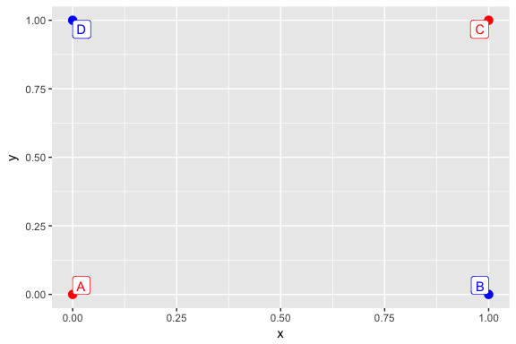
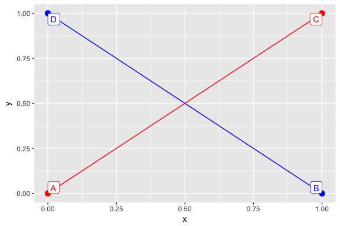
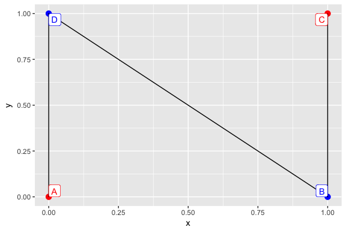
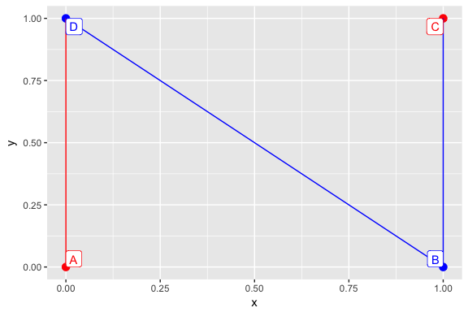
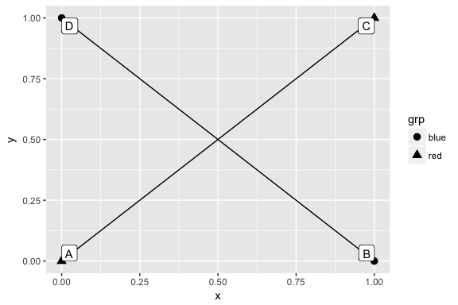
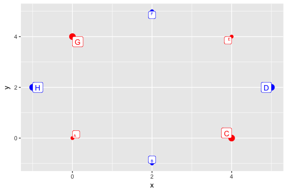
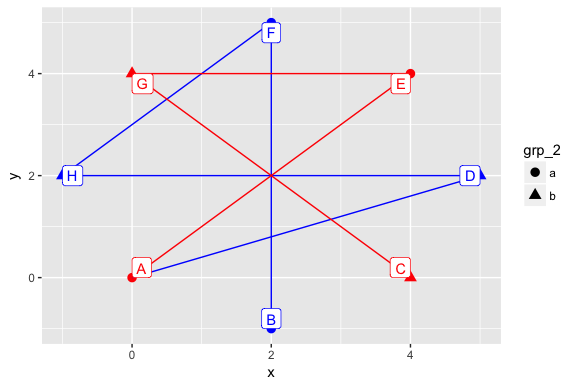

# ggplot2: exploration of the group aesthetics


I have made several plots with `ggplot2` in the past 2 years and occasionally got errors related to the group aesthetics. I solved these issues without once taking the time to fully understand how the group aesthetic works. This blogpost is a result of my experiments to finally explore how it works. My understanding is a combination of my experiments and Hadley Wickhams outstanding book about ggplot2. (https://github.com/hadley/ggplot2-book)

## Scenario 1: mapping based on one variable

Our dummy data will be a unit square. We labeled its points as common in maths: counter-clockwise.


```r
dt <- data.table(
    x = c(0, 0, 1, 1),
    y = c(0, 1, 0, 1),
    grp = c('red', 'blue', 'blue', 'red'),
    id = c('A', 'D', 'B', 'C')
)
```

### Case 1: we have a global mapping applicable to lines


```r
dt %>% ggplot(aes(x, y, col = I(grp))) +
    geom_point(size = 3) +
    geom_label(aes(label = id), vjust = "inward", hjust = "inward")
```

<!-- -->

We may want to join the points with segments. By default, the line geom inherits the color argument from the call to `ggplot`. The group aesthetic is a combination of all discrete mappings, in this case the default group for the line geom will be the same as for the colors.


```r
dt %>% ggplot(aes(x, y, col = I(grp))) +
    geom_point(size = 3) +
    geom_line() +
    geom_label(aes(label = id), vjust = "inward", hjust = "inward")
```

<!-- -->

We may want to link the points with segments joining together. One option is to overwrite the color mapping for this layer.


```r
dt %>% ggplot(aes(x, y, col = I(grp))) +
    geom_point(size = 3) +
    geom_line(aes(col = NULL)) +
    geom_label(aes(label = id), vjust = "inward", hjust = "inward")
```

<!-- -->

Another option is to overwrite the silently set `group` aesthetic and setting it constant. This way the segments will inherit their color from their (left) neighbour point.


```r
dt %>% ggplot(aes(x, y, col = I(grp))) +
    geom_point(size = 3) +
    geom_line(aes(group = 'arbitrary_constant_value')) +
    geom_label(aes(label = id), vjust = "inward", hjust = "inward")
```

<!-- -->

What order are the points linked? Now left-to-right, and order of appearance in data is coincidentally the same order as the points appear in the dataset, so we have to make further experiments.


```r
dt_mixed <- data.table(
    x = c(1, 0, 1, 0),
    y = c(1, 0, 0, 1),
    grp = c('red', 'red', 'blue', 'blue'),
    id = c('A', 'C', 'B', 'D')
)
```


```r
dt_mixed %>% ggplot(aes(x, y, col = I(grp))) +
    geom_point(size = 3) +
    geom_line(aes(group = 'arbitrary_constant_value')) +
    geom_label(aes(label = id), vjust = "inward", hjust = "inward")
```

<!-- -->

We can safely conclude that the order in which the points are linked is left-to-right, order of appearance.

### Case 2: we have a global mapping not applicable to lines

A slightly different case when the aesthetic defined in the `ggplot` call is not applicable to lines. It will still effect the silently set group aesthetics.


```r
dt %>% ggplot(aes(x, y, pch = grp)) +
    geom_point(size = 3) +
    geom_line() +
    geom_label(aes(label = id), vjust = "inward", hjust = "inward")
```

<!-- -->

We can still overwrite the `pch` aesthetics in the `geom_line` call thus silently unsetting the `group` variable.


```r
dt %>% ggplot(aes(x, y, pch = grp)) +
    geom_point(size = 3) +
    geom_line(aes(pch = NULL)) +
    geom_label(aes(label = id), vjust = "inward", hjust = "inward")
```

```
## Warning: Ignoring unknown aesthetics: shape
```

<!-- -->

However in this case explicitly setting the `group` aesthetics is inarguably more clear. We even got a warning saying "Ignoring unknown aesthetics: shape".


```r
dt %>% ggplot(aes(x, y, pch = grp)) +
    geom_point(size = 3) +
    geom_line(aes(group = 1)) +
    geom_label(aes(label = id), vjust = "inward", hjust = "inward")
```

<!-- -->

What happens when the group variable is a combination of more mappings?

## Scenario 2: mapping based on two variables

###  Case 1: one discrete and one continuous variable

To join the points in a group with line segments we need at least two points so we need to define a slightly bigger dataset to experiment with.


```r
dt <- data.table(
    x = c(0,2,4,5,4,2,0,-1),
    y = c(0,-1,0,2,4,5,4,2),
    grp_1 = c('red','blue','red','blue','red','blue','red','blue'),
    grp_2 = c(2,2,4,4,2,2,4,4),
    id = LETTERS[1:8]
)
```


```r
dt %>% ggplot(aes(x, y, col = I(grp_1), size = I(grp_2))) +
    geom_point() +
    geom_label(aes(label = id), vjust = "inward", hjust = "inward")
```

<!-- -->

By default we will have 2 group of 4 points linked together: one group for each value of the discrete variable used in the aesthetics call in `ggplot`.


```r
dt %>% ggplot(aes(x, y, col = I(grp_1), size = I(grp_2))) +
    geom_point() +
    geom_line() +
    geom_label(aes(label = id), vjust = "inward", hjust = "inward")
```

<!-- -->

One option is to overwrite the color and size mapping in `geom_line`:


```r
dt %>% ggplot(aes(x, y, col = I(grp_1), size = I(grp_2))) +
    geom_point() +
    geom_line(aes(col = NULL, size = NULL)) +
    geom_label(aes(label = id), vjust = "inward", hjust = "inward")
```

<!-- -->


Another option is to set the group aesthetics to a constant:


```r
dt %>% ggplot(aes(x, y, col = I(grp_1), size = I(grp_2))) +
    geom_point() +
    geom_line(aes(group = 1)) +
    geom_label(aes(label = id), vjust = "inward", hjust = "inward")
```

<!-- -->

### Case 2: two discrete variables


```r
dt <- data.table(
    x = c(0,2,4,5,4,2,0,-1),
    y = c(0,-1,0,2,4,5,4,2),
    grp_1 = c('red','blue','red','blue','red','blue','red','blue'),
    grp_2 = c('a', 'a', 'b', 'b', 'a', 'a', 'b', 'b'),
    id = LETTERS[1:8]
)
```

By default we have 4 pair of pairwise linked points: one for each combination of the two discrete variables used in the aesthetics call of `ggplot`.


```r
dt %>% ggplot(aes(x, y, col = I(grp_1), pch = grp_2)) +
    geom_point(size = 3) +
    geom_line() +
    geom_label(aes(label = id), vjust = "inward", hjust = "inward")
```

<!-- -->

We can overwride one or two of these in the aes call in `geom_line`:


```r
dt %>% ggplot(aes(x, y, col = I(grp_1), pch = grp_2)) +
    geom_point(size = 3) +
    geom_line(aes(pch = NULL)) +
    geom_label(aes(label = id), vjust = "inward", hjust = "inward")
```

```
## Warning: Ignoring unknown aesthetics: shape
```

<!-- -->


```r
dt %>% ggplot(aes(x, y, col = I(grp_1), pch = grp_2)) +
    geom_point(size = 3) +
    geom_line(aes(col = NULL, pch = NULL)) +
    geom_label(aes(label = id), vjust = "inward", hjust = "inward")
```

```
## Warning: Ignoring unknown aesthetics: shape
```

<!-- -->

We can also set the group aesthetics to constant or combine these two approaches.


```r
dt %>% ggplot(aes(x, y, col = I(grp_1), pch = grp_2)) +
    geom_point(size = 3) +
    geom_line(aes(group = 1)) +
    geom_label(aes(label = id), vjust = "inward", hjust = "inward")
```

<!-- -->


```r
dt %>% ggplot(aes(x, y, col = I(grp_1), pch = grp_2)) +
    geom_point(size = 3) +
    geom_line(aes(group = 1, pch = NULL)) +
    geom_label(aes(label = id), vjust = "inward", hjust = "inward")
```

```
## Warning: Ignoring unknown aesthetics: shape
```

<!-- -->

**What happens if we specify the `group` variable outside `aes`?**


```r
dt %>% ggplot(aes(x, y, col = I(grp_1), pch = grp_2)) +
    geom_point(size = 3) +
    geom_line(group = 1) +
    geom_label(aes(label = id), vjust = "inward", hjust = "inward")
```

<!-- -->

The order in which the segments are linked has been changed. But to what? Let's find out by targeted experiments.


```r
dt %>% ggplot(aes(x, y, col = I(grp_1), pch = grp_2)) +
    geom_point(size = 3) +
    geom_line(group = 1, aes(col = NULL)) +
    geom_label(aes(label = id), vjust = "inward", hjust = "inward")
```

<!-- -->


```r
dt %>% ggplot(aes(x, y, col = I(grp_1), pch = grp_2)) +
    geom_point(size = 3) +
    geom_line(group = 1, aes(pch = NULL)) +
    geom_label(aes(label = id), vjust = "inward", hjust = "inward")
```

```
## Warning: Ignoring unknown aesthetics: shape
```

<!-- -->


```r
dt %>% ggplot(aes(x, y, col = I(grp_1), pch = grp_2)) +
    geom_point(size = 3) +
    geom_line(group = 1, aes(col = NULL, pch = NULL)) +
    geom_label(aes(label = id), vjust = "inward", hjust = "inward")
```

```
## Warning: Ignoring unknown aesthetics: shape
```

<!-- -->


This way in the background we still have the group in aesthetics: it has effect although we overwrote the effect of joining lines, we did not overwrote every effect of the aesthetics mapping. So the order in which the points are linked: first levels of the group, then left to right, then order of appearance in dataset. Check for yourself with the above examples!

*e.g. blue < red, circle < triangle.*

# Conclusion

Group is the interaction of discrete variables set inside `aes` unless explicitly overwritten.

The order in which the points are linked:

1. order of group levels
2. left-to-right
3. order of appearance in data
